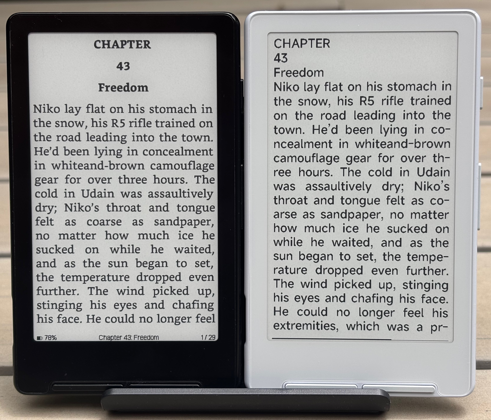
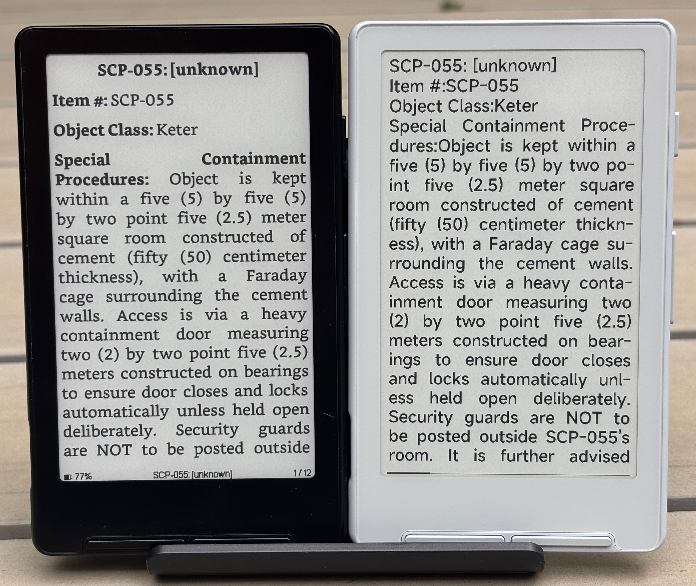
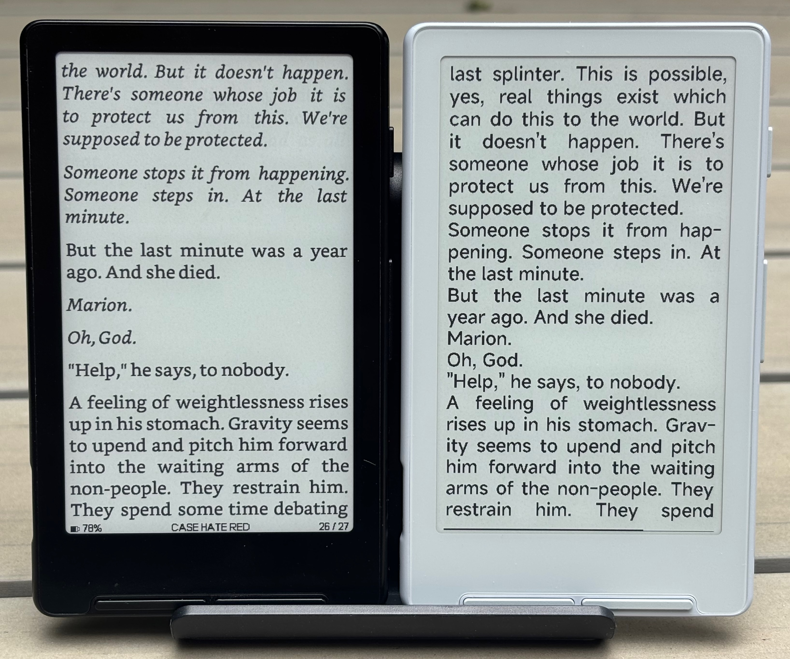
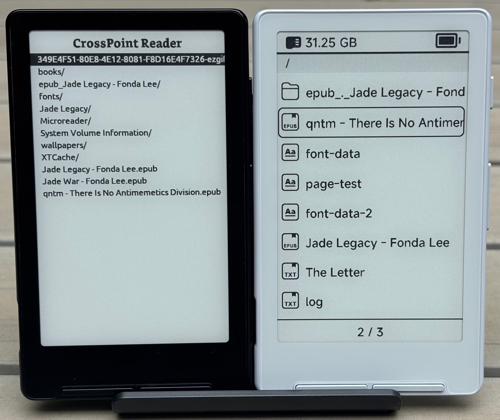
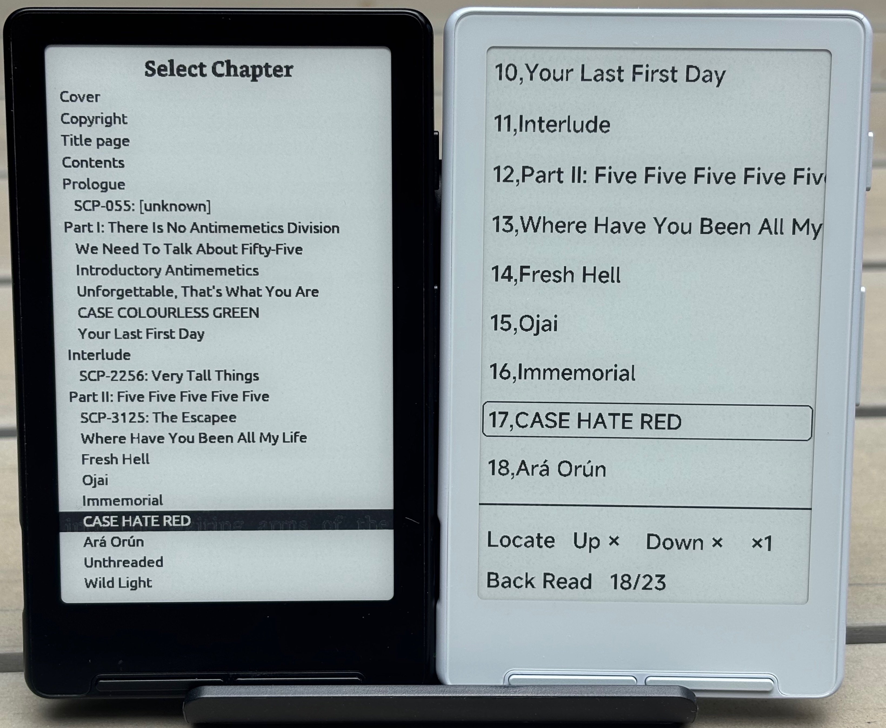

# CrossPoint vs XTOS

Below is like for like comparison of CrossPoint (version 0.5.1) and XTOS (version 3.1.1). CrossPoint is on the left, 
XTOS is on the right. CrossPoint does not currently support all features of XTOS, so this comparison is just of key 
features which both firmwares support.

## EPUB reading

## Menus

